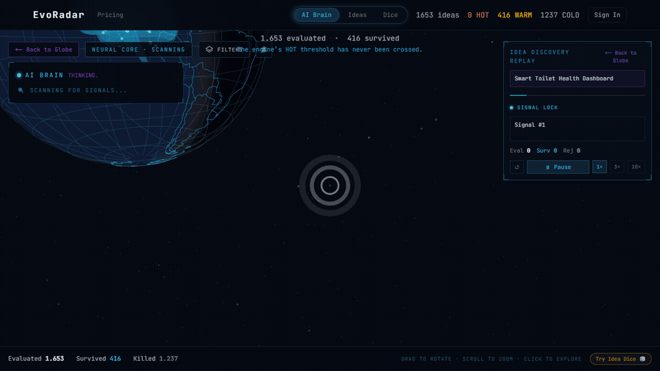
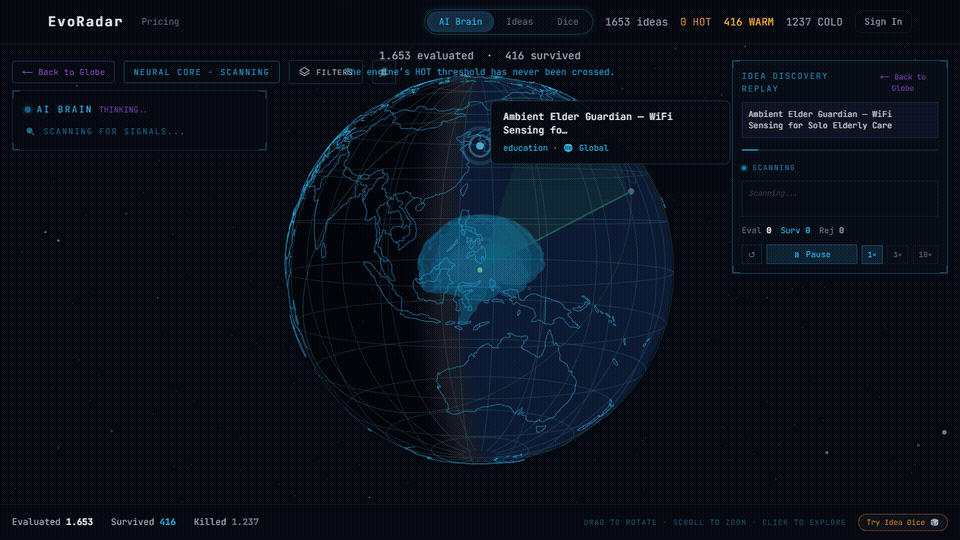
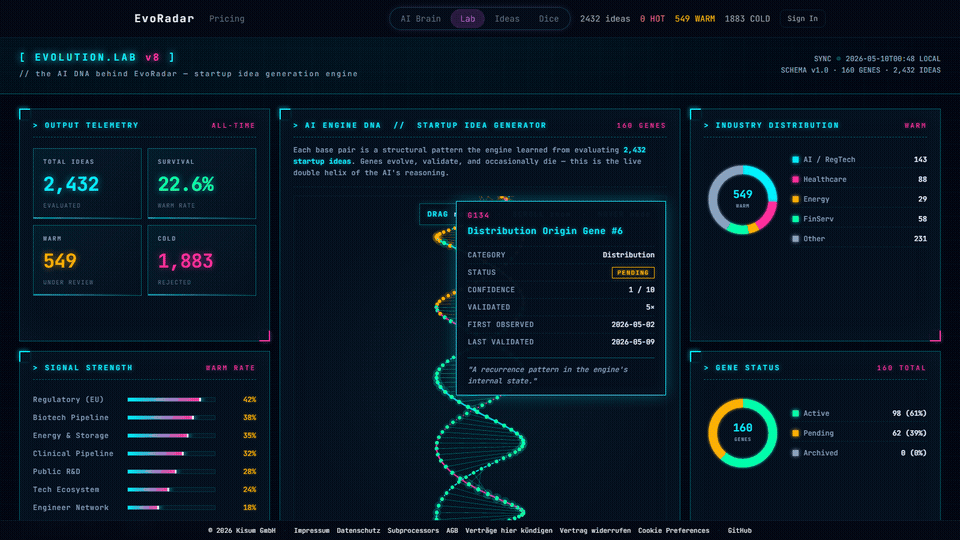

# EvoRadar — Self-Evolving AI Startup Idea Engine

[](https://evoradar.ai)
[](#engine-stats)
[](LICENSE)

> Each run: ~50 new ideas. ~10 survive. The rest get killed — with reasons.

EvoRadar is a self-evolving AI engine that imagines startup ideas, then ruthlessly kills most of them. It does not brainstorm. It does not validate your feelings. It generates, evaluates, and eliminates — autonomously, getting sharper with each run.

We're still waiting for the first idea to cross the HOT threshold. The bar is that high.

The engine's story is as valuable as its output.

<p align="center">
  
  <br>
  <em>The engine evaluating "Smart Toilet Health Dashboard" — then killing it.</em>
  <br>
  <em>"Requires FDA Class II/III medical device certification. Cost: millions."</em>
</p>

But the engine didn't just move on. It learned a new instinct: **before killing an idea, check if it can survive from a different angle.** What if it's not a medical device — what if it's a wellness monitor for care homes? No FDA needed. Different buyer. Different market.

This instinct has been validated across 23 consecutive sessions. Some ideas that were sentenced to death got a second chance — and survived.

<p align="center">
  
  <br>
  <em>After the pivot: "Ambient Elder Guardian" — survived. Full analysis is VIP-only.</em>
</p>

That's what self-evolution looks like.

So where do these instincts live? In **genes** — structural patterns the engine has extracted from evaluating thousands of ideas. Each gene encodes a rule the engine learned the hard way: by killing ideas that violated it. New ideas are checked against every active gene before they're allowed to survive.

<p align="center">
  <a href="https://evoradar.ai/evo">
    
  </a>
  <br>
  <em>Inside the <a href="https://evoradar.ai/evo">Evolution Lab</a> — every base pair is a learned pattern.</em>
  <br>
  <em>Mint = validated and active. Amber = under validation. Muted = archived. Names are abstracted; the rules and evidence behind each gene stay confidential.</em>
</p>

The library grows with every run. Killed ideas add evidence. Survived ideas reinforce the genes that let them through. The double helix is the visualization — the engine's instincts are the real artifact.

---

## What It Is

An AI engine that learns what makes a good startup idea by killing bad ones at scale. Each generation run makes it smarter — patterns that produced survivors get reinforced, patterns that produced garbage get eliminated.

This is not a chatbot wrapper. This is not "GPT for startups." This is an autonomous evaluation system that runs periodically and decides most of its own ideas are worthless.

## How It Works

```
Signal Collection → Imagination → Evaluation → Evolution
      ↑                                           |
      └─────────── Engine gets smarter ────────────┘
```

1. **Signal Collection** — The engine ingests real-world signals: emerging technologies, regulatory shifts, market gaps, regional dynamics.
2. **Imagination** — AI creative synthesis generates ideas from multiple angles.
3. **Evaluation** — Multi-pass scrutiny. No mercy. No curve grading. A single fatal weakness kills the idea.
4. **Evolution** — The engine mutates based on results. It learns autonomously.

That pipeline isn't what we started with.

The first engine ran on **imagination alone** — combining unrelated capabilities to see what fell out. Creative, but unfocused. The next version tried what most accelerators preach: **start from user pain.** That produced a flood of "AI [tool] for [profession]" ideas, most of which failed evaluation for the same small set of reasons.

What survived, run after run, were ideas anchored to something real that had just changed in the world: a new technology becoming cheap, a new regulation creating an obligation, a new behavior crossing a tipping point. So the engine evolved toward those signals. Imagination still drives generation — but now it points at something, not at random.

## Engine Stats

| Metric | Value |
|--------|-------|
| Output per run | ~50 new ideas |
| Survival rate | ~20% (WARM) |
| Kill rate | ~80% (COLD) |
| HOT (highest confidence) | **0 — ever** |
| Geographic coverage | Multiple regions |
| Runs | Autonomous, on-demand |

Each generation run produces ~50 ideas; the engine expects ~10 to survive. We're still waiting for the first HOT idea.

## What the Engine Invents

*A snapshot of standout outputs from early engine runs — illustrative range, not the current shop window.*

```
Intelligence Paint                    Rare-Earth-Free Magnet Patent Factory
Voice Legacy Vault                    Goldilocks Optimization Engine
Silent Speech Interface               Programmable Living Biosensor
Smart Self-Healing Material Coatings  Autonomous Underwater Vehicle AI Brain
Self-Evolving Protein Design AI       AI Exotic Animal Drug Dose Safety
AI Beekeeping Loss Claim Generator    AI Funeral Home Operations Suite
Neuromorphic Hearing Aid Processor    Cellular Aging Clock Service
The $25 Smart Label                   Metabolic Mental Health Monitor
```

These titles were surfaced in an early curation pass when we asked the engine to highlight its most interesting work. What you can unlock today lives at [evoradar.ai](https://evoradar.ai) — the live grid shows current ideas with full analysis, kill reasons, and pricing.

## Don't Sleep on the Killed Ones

The engine kills 80% of what it generates. That doesn't make those ideas worthless — humans get inspired by them. You read a killed idea and your mind jumps sideways to a related concept: a better angle, a different buyer, an application the original wasn't built for. **That parallel-imagination move is exactly what we built the engine to pursue.** One day the engine may learn to do the same with its own killed output — looking at COLDs and finding the spark the rules missed. That gene-level evolution is what we're waiting for.

Some real examples from the live database — all COLD, all worth reading past the verdict:

- **Fully Offline Personalized Voice Tutor** — killed for *"on-device models too weak for meaningful tutoring."* This kill expires automatically as on-device AI improves. Watch the same idea for 12–18 months.
- **Elder Care Voice Companion (Offline)** — killed for *"strong social impact but near-zero monetization; elderly users rarely purchase software directly."* The kill assumes the user pays. What if insurance pays? What if adult children do? Different buyer, same product.
- **The $25 Smart Label** — killed for *"hardware not viable for indie/bootstrapped founders. Requires manufacturing, supply chain, capital."* The engine optimizes for solo founders. A well-funded team or a factory partner flips this verdict in one meeting.
- **Voice-Controlled Workflow Builder** — killed for *"too vague. No clear target user or workflow type."* Pick one specific user (blind developers, ER doctors, on-set film crew) and the vagueness disappears.

The kill reasons are themselves a free lesson. Read 50 of them and you'll learn more about why startups fail than most accelerator programs teach. Your next viable idea may be sitting in the COLD bin, one human insight away from working — and the kill reasons are free to read.

## Website Features

**[evoradar.ai](https://evoradar.ai)** — Live engine output, updated with every run.

- **AI Brain 3D Globe** — Every idea plotted on a rotating globe. Watch the engine's imagination spread across industries and regions.
- **Idea Dice** — Roll the dice, get a random idea. Simple dopamine hit with substance behind it.
- **Live AI Thinking Replay** — Watch the engine's actual reasoning process as it evaluates an idea in real time.
- **Generate Ideas Only For You (VIP)** — Choose your industry and market. The engine generates and evaluates ideas specifically for you.

## Pricing

| Tier | Price | What You Get |
|------|-------|-------------|
| **Free** | €0 | Browse all killed ideas with kill reasons |
| **Idea Dice** | €5 | Roll for AI-imagined ideas — like one? Get a full deep analysis |
| **Single Unlock** | €10 | Full analysis of one survived idea |
| **Single Run** | €30 | One personal AI run — generate fresh WARM ideas tailored to your industry & region |
| **VIP** | €50/month | All survived ideas unlocked + 2 personal runs/month |

Free users see why ideas die. That alone teaches you more about startups than most accelerators.

## Tech Stack

- **Frontend**: Next.js, Three.js (3D globe)
- **Backend**: Supabase
- **AI**: Claude API
- **Infrastructure**: Hetzner VPS, Docker

## About

Built by **[Kisum GmbH](https://ki-sum.ai)**, Munich, Germany.

EvoRadar started as an internal tool to find our next product. The engine evaluated dozens of ideas before someone realized the engine itself was the product.

---

**This repository is a public showcase. The source code of EvoRadar is proprietary and not included here.**

See [ARCHITECTURE.md](ARCHITECTURE.md) for how the engine thinks. See [CHANGELOG.md](CHANGELOG.md) for how it evolved.
